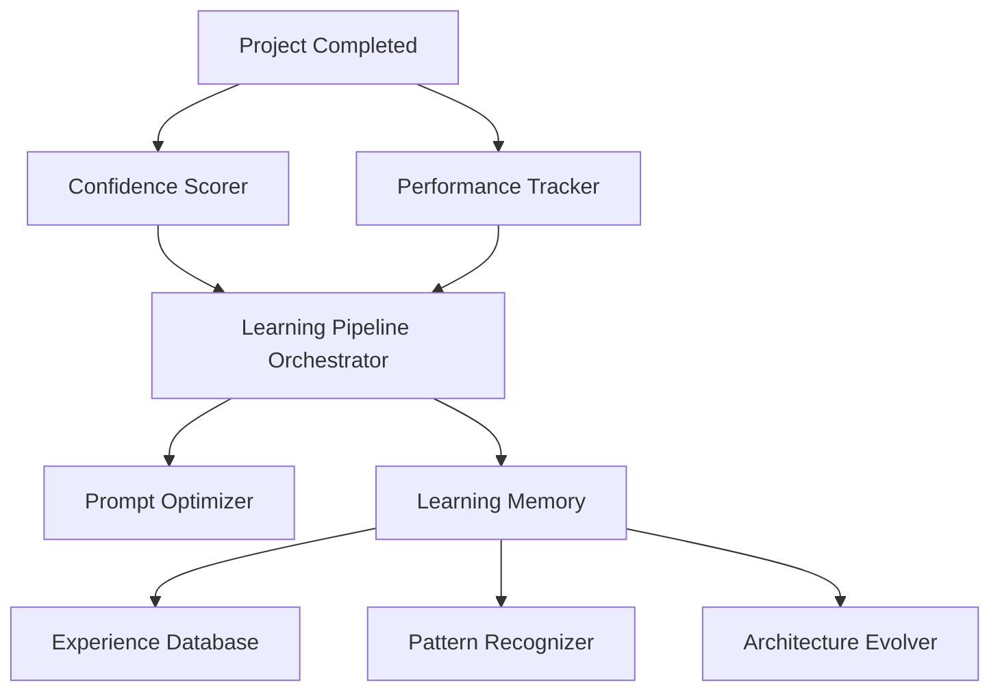

# Continuous Learning Engine Architecture

This document outlines the design and operational flow of the continuous learning subsystem in AIForge.

## 1. Design Overview
The Continuous Learning Engine turns AIForge into a self-improving platform by persistent feedback loops. It scrapes execution timings, counts tokens, checks compiler status, analyzes reviewer corrections, optimizes prompt templates, and indexes successful layouts for future reuse.

## 2. Memory Database Schema
Completed projects store a summary JSON file under `backend/learning/memory/`:
* `project`: Project Name (str)
* `timestamp`: Unix time (float)
* `technologies`: Array of frameworks (list)
* `mistakes`: Critical failure records (list)
* `fixes`: Resolution steps (list)
* `best_practices`: Folder layouts and security schemes (dict)
* `performance`: Tokens count and generation latency (dict)
* `final_score`: Computed confidence (int)

## 3. Experience Reuse Flow
Before generating a project, the planner queries the Experience Database:
1. Performs keyword search (TF-IDF overlap) over project descriptions.
2. If similar project exists, extracts the stored layout, database schema, and verification pipelines.
3. Feeds suggestions to agents, shortening build cycles.

## 4. Prompt Refinement Logic
When compiler or reviewer corrections flag vulnerabilities, system prompts inside `prompts/` (e.g. `backend.txt`) are rewritten dynamically by the prompt engineering model. Revised templates are hot-reloaded by the agents on future runs.
